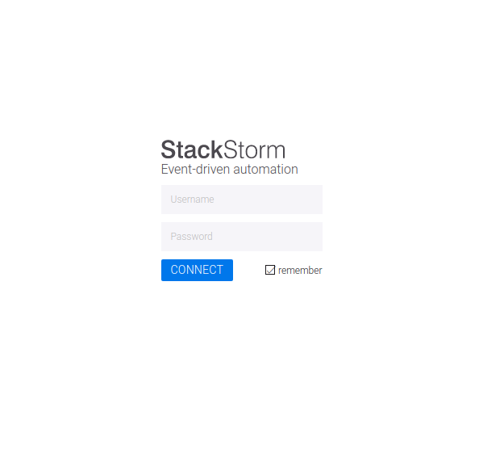
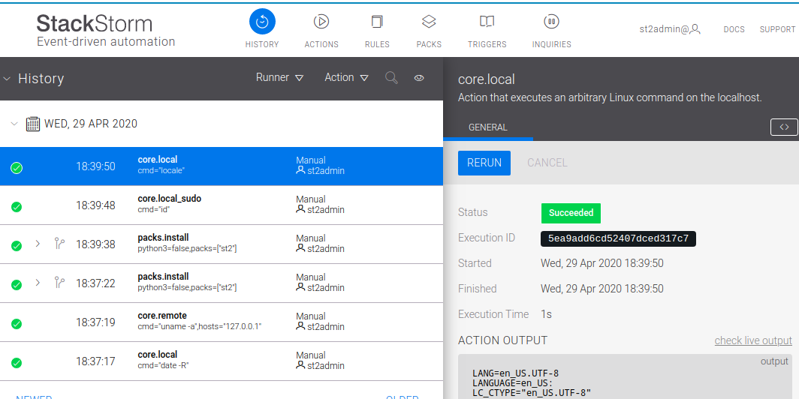
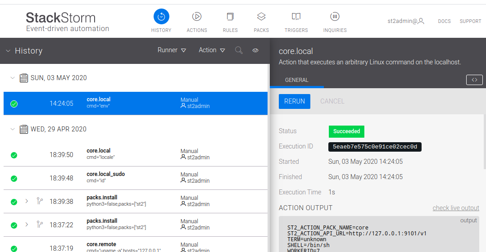
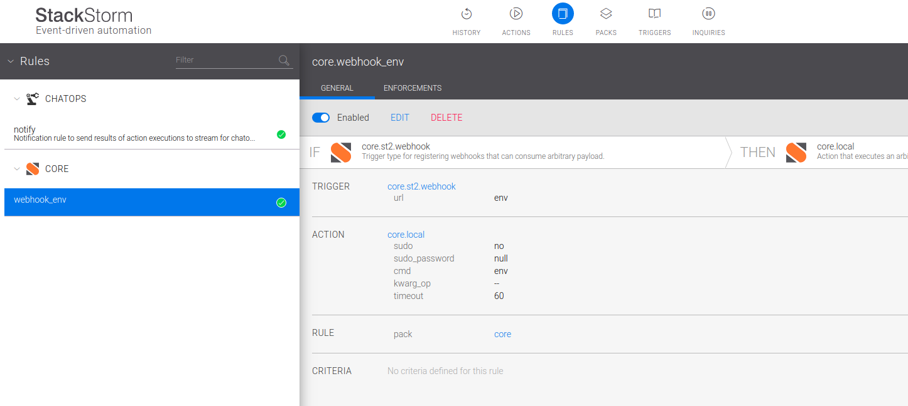
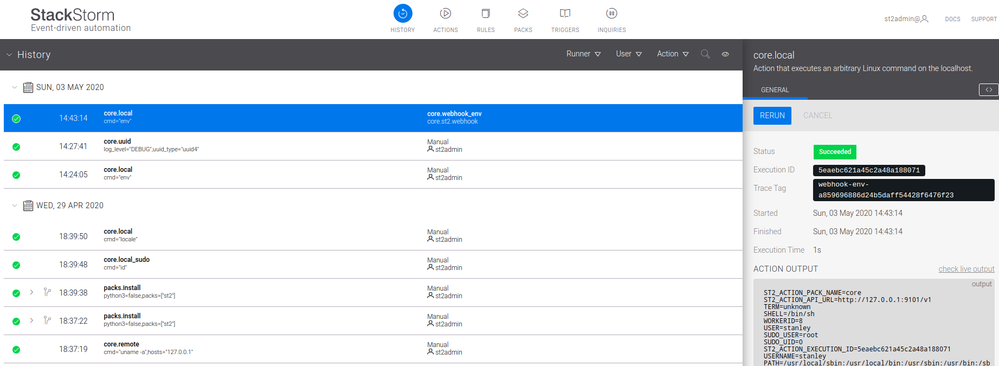

# Spike on StackStorm

The goal of this spike is to experiment with [StackStorm](https://docs.stackstorm.com/install/vagrant.html). StackStorm is a platform for integration and automation across services and tools.

StackStorm should be compare on some usage with :

* [rundeck](https://www.rundeck.com/open-source)
* [IFTTT](https://ifttt.com/)
* [zapier](https://zapier.com/app/login?next=%2Fapp%2Fdashboard)

## Benefits / Inconvenients of StackStorm

* actions can be audited on short term
* webhook to run actions system with internal api key system
* [support passive & polling sensor](https://docs.stackstorm.com/sensors.html#passive-sensors)
* [extensible with its own actions & sensors](https://docs.stackstorm.com/reference/packs.html#create-and-contribute-a-pack)
* [4 components of infrastructure to host and operate](https://docs.stackstorm.com/install/overview.html)
* [upgrade procedure may requires manual intervention](https://docs.stackstorm.com/install/upgrades.html), well handle in [docker image](https://github.com/StackStorm/st2-docker/blob/master/images/stackstorm/Dockerfile)
* [native garbage collector for audit actions](https://docs.stackstorm.com/troubleshooting/purging_old_data.html)

## 1. Watch the introduction video of StackStorm

[](https://youtu.be/MtPw1WC9pxA)

## 2. Install a StackStorm platform with Vagrant

2.1 . I have followed the instuction of [Vagrant QuickStart](https://docs.stackstorm.com/install/vagrant.html#vagrant-quick-start)

```bash
vagrant up
vagrant ssh
```

2.2 . let's open a browser on `http://10.10.10.10`



StackStorm login details

* Username: st2admin
* Password: Ch@ngeMe

2.3 . we should be on the home



## 3. Execute an action manually on StackStorm platform

let's go on [action](https://10.10.10.10/#/actions) and run `core.local` with command `env`.



## 4. Execute an action based on Webhook

The webhook trigger is the standard way to execute `StackStorm` rule.

* [StackStorm Authentication - Token](https://docs.stackstorm.com/authentication.html#testing)
* [StackStorm Authentication - Api Key](https://docs.stackstorm.com/authentication.html#api-key-usage)
* [Stackstorm WebHook](https://docs.stackstorm.com/webhooks.html#webhooks)

**4.1 . Create a rule**



**4.2 . Create an api key**

4.2.1 . let's connect on vagrant machine through ssh

```bash
vagrant ssh
```

4.2.2 . create an api key using `st2`

```bash
st2 apikey create
```

**4.3 . Execute the rule using api request**

```bash
# fetch an api token
curl -X POST -k -u st2admin:'Ch@ngeMe' https://10.10.10.10/auth/v1/tokens

TOKEN= #your token value

# execute api query
curl -XPOST  -H "X-Auth-Token: ${TOKEN}" -H "Content-Type: application/json" -k https://10.10.10.10/api/v1/webhooks/env
```

**4.4 . Check the execution on history**



**4.5 . Execute and fetch the result of execution**

```bash
curl -X POST https://10.10.10.10/api/v1/executions -H  'content-type: application/json' -H  "X-Auth-Token: ${TOKEN}" --data-binary '{"action": "core.local", "user": null, "parameters": {"cmd": "env"}}'
```